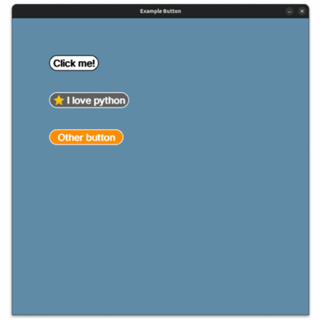

# PyGets

PyGets is a lightweight widget toolkit for building small interfaces on top of `pygame`. It gives you reusable controls such as buttons, sliders, text inputs, toggles, dropdowns, and popups without forcing a larger UI framework on your project.



## What you get

- `Button` for text, icons, or both
- `Checkbox` for boolean flags
- `Combobox` for dropdown selection
- `Popup` for modal-style messages
- `Slider` for numeric ranges
- `Textbox` for editable text input
- `Togglebutton` for switch-style states

## Project structure

```text
pygets/
  core/      # theme objects and widget base classes
  widgets/   # public widgets
  utils/     # validators and shared color helpers
examples/    # runnable pygame demos
tests/       # widget tests
docs/        # MkDocs documentation
```

## Install

```bash
pip install .
```

For development:

```bash
pip install -e .
pip install -r requirements-dev.txt
```

## Quick example

```python
import pygame

from pygets.core.theme import themes
from pygets.widgets import Button

pygame.init()

screen = pygame.display.set_mode((800, 500))
font = pygame.font.Font(None, 28)
button = Button(
    x=80,
    y=80,
    font=font,
    screen=screen,
    theme=themes["light"],
    text="Click me",
)

clock = pygame.time.Clock()
running = True

while running:
    clock.tick(60)

    for event in pygame.event.get():
        if event.type == pygame.QUIT:
            running = False
        if event.type == pygame.MOUSEBUTTONDOWN and event.button == 1:
            if button.rect.collidepoint(event.pos):
                print("Button pressed")

    screen.fill((96, 140, 168))
    button.draw()
    pygame.display.flip()

pygame.quit()
```

## Run the examples

Individual demos live in `examples/`.

```bash
python examples/example_button.py
python examples/example_textbox.py
python examples/example_slider.py
```

To launch every example one after another:

```bash
python examples/run_all.py
```

## Next steps

- Start with the setup guide in [Guide](getting-started.md)
- Learn how themes and colors work in [Styles](customization.md)
- See contribution rules in [Community](CONTRIBUTING.md)
